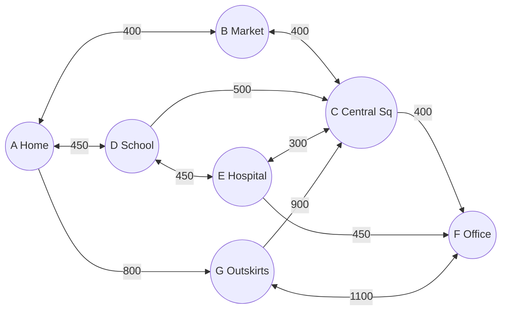

# Smart Traffic Management System

A C++17 simulation of a city road network with three features:

1. **Dynamic traffic lights**: each signal's green and red times adapt to how congested its road is.
2. **Route optimization**: Dijkstra's algorithm finds the least congested route to a vehicle's destination without sending it on long detours.
3. **Accident alerts**: simulated road sensors detect collisions, and drivers who are affected get one alert per accident.

```bash
make run        # build and run the three demo scenarios
```

Requires any C++17 compiler (tested with Apple clang 17). There are no external dependencies.

---

## How the city is modelled

| Concept | Class | What it holds |
|---|---|---|
| Intersection | `Intersection` | A graph **node**. It keeps a map of its incoming roads (one traffic light each) and its outgoing roads. |
| Road | `Road` | A **one-way** graph edge between two intersections. It holds its length, capacity and the set of vehicles currently on it. A two-way street is two `Road` objects. |
| Vehicle | `Vehicle` | Its planned route and the road it is currently on. |
| City | `TrafficNetwork` | Owns all of the above, connects roads to intersections and moves vehicles between roads. |

**Congestion** comes straight from the vehicle count:

```
congestion = vehicles on road / road capacity        (0.0 = empty, 1.0 = full)
```

**Routes** use the same format for input and output:

```
[source intersection, road 1, road 2, ..., destination intersection]
e.g. [A, R_AB, R_BC, R_CF, F]
```

---

## 1. Dynamic traffic lights (`TrafficLightManager`)

**Input:** an intersection. **Output:** a green and red time for every road that enters it.

The lights run in a cycle, one road at a time. While one road is green, all the others are red, so:

```
red time of a road = sum of the other roads' green times
```

**Step 1: rule-based green times.** Each road is placed in a tier according to its congestion:

| Congestion | Tier | Green |
|---|---|---|
| no vehicles | EMPTY | 5 s |
| below 0.25 | LIGHT | 15 s |
| below 0.50 | MODERATE | 35 s |
| below 0.75 | HEAVY | 60 s |
| below 0.90 | SEVERE | 90 s |
| 0.90 or above | JAMMED | 120 s |
| accident on the road | BLOCKED | 5 s (no traffic can reach the light) |

**Step 2: the 2-minute cap.** No light may stay red for more than 120 s, because a long red makes queues build up on the waiting roads. If any red is too long, every green above the 5 s minimum is shrunk **by the same factor** and the check runs again. Using one factor for every road keeps the priority order, so the busiest road still gets the longest green.

**Example** (intersection C at rush hour, from scenario 1):

| Road | Load | Tier | Green | Red |
|---|---|---|---|---|
| R_BC | 19/20 | JAMMED | 73 s | 50 s |
| R_DC | 12/20 | HEAVY | 36 s | 87 s |
| R_EC | 3/20 | LIGHT | 9 s | 114 s |
| R_GC | 0/20 | EMPTY | 5 s | 118 s |

With fixed 60 s greens, every road here would wait 180 s at red.

---

## 2. Route optimization (`RouteOptimization`)

**Input:** a vehicle's current route. **Output:** a better route in the same format.

```cpp
RouteOptimization router(city, /* congestionPenalty */ 3.0);
car.requestOptimizedRoute(router);   // the vehicle calls the optimizer and adopts the result
```

### The graph

Intersections are nodes and roads are **directed** edges, so a route can never go the wrong way down a one-way road. Each road costs:

```
cost = length × (1 + congestionPenalty × congestion)
```

`congestionPenalty` is a **tuning setting** the caller must provide; there is no built-in value.

- `0`: congestion is ignored, and the result is simply the shortest route.
- Higher values: congested roads cost more, so traffic spreads onto quieter roads.
- A fully jammed road costs `(1 + penalty)` times its length.

Roads closed by an accident are skipped entirely.

### Keeping vehicles headed towards the destination

The cheapest route by congestion alone can be a long detour, for example an empty ring road on the far side of town. To prevent this, the optimizer first works out which roads are sensible to use at all:

1. Two plain-distance Dijkstra runs give every intersection's distance **from the source** and **to the destination**.
2. A road `u → v` is allowed only if
   `distance(source → u) + length(u → v) + distance(v → destination) ≤ 1.5 × shortest trip`.
3. This removes dead ends, roads that head away from the destination, and wide detours.

The main Dijkstra search then runs on the congestion-weighted costs, using only the allowed roads.

### Example (scenario 2)

The usual route passes through R_BC, which holds 18 of its 20 vehicles:

| Setting | Result | Cost |
|---|---|---|
| input | `[A, R_AB, R_BC, R_CF, F]` | 2640 |
| penalty 0.5 | keeps the original route (the jam is not costly enough to avoid) | 1440 |
| penalty 3.0 | `[A, R_AD, R_DE, R_EF, F]`: avoids the jam | 2362 |
| penalty 3.0, detour check **off** | `[A, R_AG, R_GF, F]`: a 1900 m detour through the outskirts | 1900 |

The last row shows what the detour check prevents.

---

## 3. Accident alerts (`CollisionSensor`, `AccidentAlert`)

`CollisionSensor` simulates a sensor on every road. Collisions can be injected on purpose or occur at random, using a fixed seed so every run is the same. A crash stays in front of the sensor until it is cleared, so **the same crash is reported on every tick**.

On each tick, `AccidentAlert::processTick()` polls every road:

1. **New collision:** it creates an accident with a unique ID (`ACC-0001`, `ACC-0002`, …) and closes the road.
2. **Collision already being tracked:** it reuses the existing ID and ignores the duplicate.
3. **Alerts:** it notifies subscribed vehicles that are on the road or plan to use it. Each vehicle is alerted **at most once per accident**.

It returns only the new notifications, so the caller knows which vehicles to reroute. Processing the same situation again produces no new records and no repeat alerts. When an accident is cleared the road reopens, and a later crash on the same road gets a new ID. IDs are never reused.

**Example** (scenario 3, a collision on R_DE reported for three ticks):

```
[SENSOR t=1] R_DE: collision detected, NEW accident ACC-0001, road closed
[ALERT ACC-0001] V3: collision on R_DE (D -> E), which is on your route, rerouting advised
  ...
tick 1: 4 new notification(s)
[SENSOR t=2] R_DE: collision still reported, already tracked as ACC-0001 (duplicate ignored)
tick 2: 0 new notification(s)
```

The affected vehicles then reroute around R_DE, and the light facing R_DE at intersection E drops to the 5 s minimum.

---

## The demo city

Every road holds 20 vehicles. The labels are lengths in metres.



The two main routes from A to F are **A-B-C-F** (1200 m) and **A-D-E-F** (1350 m). G is a far-out ring road: it is always empty, which makes it a tempting but poor detour.

## The three scenarios in `main.cpp`

| # | Scenario | What it shows |
|---|---|---|
| 1 | Rush hour at intersection C, and a quiet intersection B | Signal times adapt to congestion and stay within the 5 s to 120 s limits. |
| 2 | A car's usual route is jammed | Rerouting, the effect of `congestionPenalty`, and the detour check. |
| 3 | A crash on road R_DE | One ID per accident, one alert per vehicle, rerouting, the light adapting to the closed road, and a new ID for a later crash on the same road. |

---

## Project structure

```
├── main.cpp                     builds the demo city and runs the three scenarios
├── Makefile
└── src/
    ├── Entities.cpp             Road, Intersection, Vehicle
    ├── TrafficNetwork.cpp       the city: owns every entity and tracks congestion
    ├── TrafficLightManager.cpp  dynamic signal timing
    ├── RouteOptimization.cpp    Dijkstra routing with the detour check
    └── AccidentAlert.cpp        collision sensor simulator and alert service
```

The project uses no header files. Each class is declared and defined in its own `.cpp` file, and `main.cpp` includes them. Only `main.cpp` is compiled, so every class is defined exactly once. Each file starts with `#pragma once`.

## Assumptions and simplifications

- A vehicle's route starts at an intersection. A vehicle already on a road is warned about an accident but not rerouted.
- Traffic lights give one road green at a time. Roads that don't conflict, such as opposite approaches, could share a green phase in a fuller model.
- Congestion is a snapshot of the vehicle count. Vehicles are placed on roads by the scenarios rather than moved by a time-stepped traffic model.
